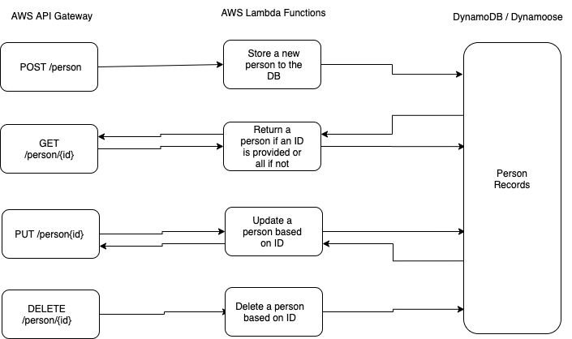

# LAB - Class 18

## Project: AWS, Dynamo, and Lambda

- The project uses four AWS API Gateways matched to four Lambda functions to insert, retrieve, update, and delete records from a dynamo database.

### Author: Simon

### Links and Resources

- [GitHub Actions](https://github.com/simon-panek/serverless-api/actions/new) 

### Setup

#### How to initialize/run your application (where applicable)

- Routes
  - POST: https://5c7osee1x2.execute-api.us-west-2.amazonaws.com/people
  - GET: https://jndzuimsqh.execute-api.us-west-2.amazonaws.com/people/{id}
  - PUT: https://40xvnzy0ql.execute-api.us-west-2.amazonaws.com/people/{id}
  - DELETE: https://ocsgdl6wvh.execute-api.us-west-2.amazonaws.com/people/{id}

#### Tests

- `npm test`
- Tests confirm the functionality of each route

#### UML

